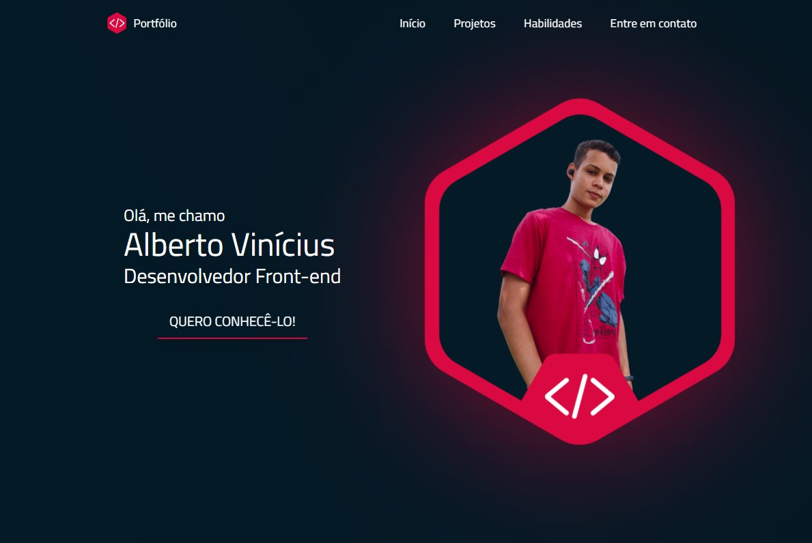

# Portfólio ❤

Um site feito inteiramente por mim, com o objetivo de possibilitar possíveis clientes ou não, a:
- Entrarem em contato comigo, conhecerem sobre mim, o que eu faço e quais minhas habilidades.  

Tudo isso de forma: fácil, visualmente harmoniosa e direta ao ponto. Havendo também minha marca pessoal e logotipo próprio.

## Screenshot

## Estrutura

Para este propósito, o portfólio conta com seções, sendo elas:
- **Bem-vindo** - Atrativo e diferente, chamar a atenção de quem busca meus serviços ou me conhecer.
- **Sobre mim** - Quem eu sou, uma breve descrição da minha trajetória e experiências.
- **Projetos** - Demonstração prática do meu aprendizado e experiências.
- **Habilidades** - Minhas hard skills (meu conhecimento técnico nas tecnologias), e meu tempo de experiência em cada uma.
- **Contato** - Uma forma de entrarem em contato comigo, requisitar meus serviços ou se comunicar diretamente.

## Stack utilizada ⚙

**Front-end:** 
  
  
  
  
  
  
  
  
**Back-end:** EmailJS

## Documentação de cores 🎨

| Cor               | Hexadecimal                                                |
| ----------------- | ---------------------------------------------------------------- |
| Cor primária       |  #da0941 |
| Cor primária escura    |  #b80c3a |
| Cor primária mais escura       |  #a10831d0 |
| Cor secundária       |  #041a27 |
| Cor secundária escura       |  #041722 |

## Autor(es) 🙎🏻‍♂️

- Instagram - [@albert.vny](https://www.instagram.com/albert.vny/?hl=pt-br)
- [Meu portfólio website](https://portfolio-allbertuu.vercel.app/) - (exatamente a aplicação desta documentação rs)
- [LinkedIn](https://www.linkedin.com/in/albertov-albuquerque/)
- [Frontend Mentor](https://www.frontendmentor.io/profile/allbertuu)

## Feedback

Se você tiver algum feedback, por favor me deixe saber por meio de albertovinicius3@gmail.com, ou pela seção "Contato" no meu portfólio.

## Licença

[MIT](https://choosealicense.com/licenses/mit/)

